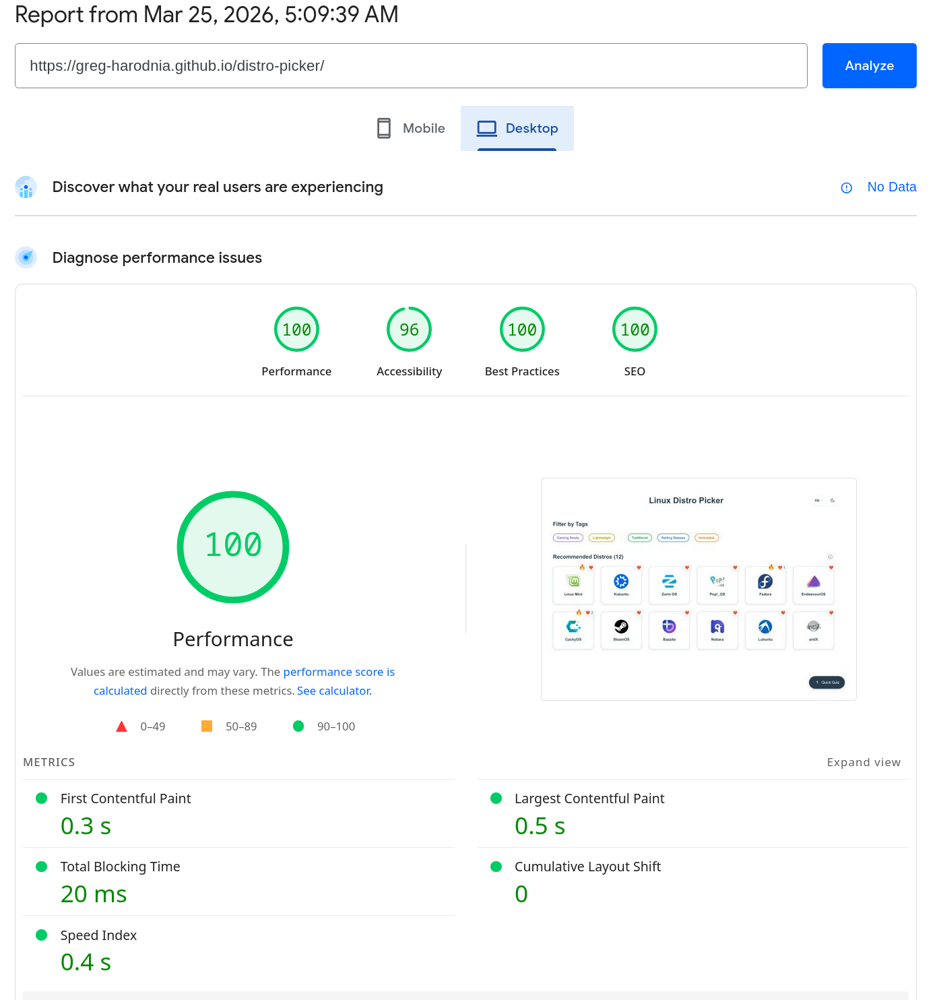

# Linux Distribution Picker

A modern Linux distribution picker built with SvelteKit to help users find the perfect Linux distribution for their needs based on gaming, development, user-friendliness, and other criteria.

 

### Install dependencies

```bash
bun install
```

### Start development server

```bash
bun run dev
```

### Create production build

```bash
bun run build
```

### Preview production build

```bash
bun run preview
```

## 📁 Project Structure

```
distro-picker/
├── src/
│   ├── app.css
│   ├── app.html
│   ├── lib/
│   │   ├── components/
│   │   │   ├── DistroGrid.svelte
│   │   │   ├── DistroGridSkeleton.svelte
│   │   │   ├── DistroPanel.svelte
│   │   │   ├── ErrorDisplay.svelte
│   │   │   ├── GalleryModal.svelte
│   │   │   ├── InfoModal.svelte
│   │   │   ├── LanguageToggle.svelte
│   │   │   ├── LoadingSpinner.svelte
│   │   │   ├── OptimizedImage.svelte
│   │   │   ├── QuickTestModal.svelte
│   │   │   ├── TagFilter.svelte
│   │   │   ├── TagSkeleton.svelte
│   │   │   └── ThemeToggle.svelte
│   │   ├── data/
│   │   ├── i18n/
│   │   │   ├── locale.ts
│   │   │   └── translations.ts
│   │   ├── locales/
│   │   │   ├── types.ts      # Type definitions
│   │   │   └── en.json       # English (used for SSR)
│   │   ├── stores/
│   │   ├── supabase.ts
│   │   ├── types/
│   │   ├── utils/
│   │   ├── distros.json
│   │   └── tags.json
│   └── routes/
│       ├── +layout.svelte
│       └── +page.svelte
├── static/
│   ├── locales/              # Translation files (edit JSON to add/edit languages, loaded via fetch)
│   └── screenshots/
├── package.json
├── svelte.config.js
├── tsconfig.json
└── README.md
```

## 🗄️ Database Structure (Supabase)

### 'distros' table

| Column | Type | Description |
|--------|------|-------------|
| id | int8 | Primary key |
| name | varchar | Distro identifier (same as 'id' in distros.json) |
| likes | int2 | Number of likes |

## 🌐 Supported Languages

The app supports **17 languages** with automatic detection based on browser language and timezone:

| Language | Code | Native Name | Auto-Detect Method |
|----------|------|-------------|-------------------|
| English | `en` | English | Browser default |
| Belarusian | `be` | Беларуская | Browser (`be`, `be-BY`) + Timezone (`Europe/Minsk`) |
| Ukrainian | `uk` | Українська | Browser (`uk`, `uk-UA`) + Timezone (`Europe/Kyiv`) |
| Polish | `pl` | Polski | Browser (`pl`, `pl-PL`) + Timezone (`Europe/Warsaw`) |
| Russian | `ru` | Русский | Browser (`ru`, `ru-RU`) + Multiple Russian timezones |
| Spanish | `es` | Español | Browser (`es`, `es-ES`, etc.) |
| Portuguese | `pt` | Português | Browser + Timezone (`America/Sao_Paulo`, `Europe/Lisbon`) |
| German | `de` | Deutsch | Browser + Timezone (`Europe/Berlin`, `Europe/Vienna`) |
| French | `fr` | Français | Browser + Timezone (`Europe/Paris`, `America/Montreal`) |
| Italian | `it` | Italiano | Browser + Timezone (`Europe/Rome`) |
| Turkish | `tr` | Türkçe | Browser + Timezone (`Europe/Istanbul`) |
| Vietnamese | `vi` | Tiếng Việt | Browser + Timezone (`Asia/Ho_Chi_Minh`) |
| Indonesian | `id` | Bahasa Indonesia | Browser + Timezone (`Asia/Jakarta`) |
| Thai | `th` | ไทย | Browser + Timezone (`Asia/Bangkok`) |
| Chinese | `zh` | 简体中文 | Browser + Timezone (`Asia/Shanghai`, `Asia/Tokyo`) |
| Japanese | `ja` | 日本語 | Browser + Timezone (`Asia/Tokyo`) |
| Korean | `ko` | 한국어 | Browser + Timezone (`Asia/Seoul`) |

### Language Detection

Language is automatically detected based on:
1. **Browser language** - Uses `navigator.language` with fallback
2. **System timezone** - Some languages are also detected by timezone (e.g., Minsk → Belarusian)

Users can manually switch languages using the language toggle. The selected language is stored in `localStorage`.

### Lazy Loading

To optimize performance, translations are lazy-loaded:
- **English** - Bundled with the app (fallback language)
- **Other languages** - Loaded on-demand as JSON files (`/locales/{lang}.json`)
- Each language file is ~10-16 KB
- Total non-English translations: ~200 KB (loaded only when needed)

### SEO

The app has a great SEO score (a11y is 96 due to tag color contrasts in the light theme).



<br>**Find Your Perfect Linux Distribution Today! 🐧**
