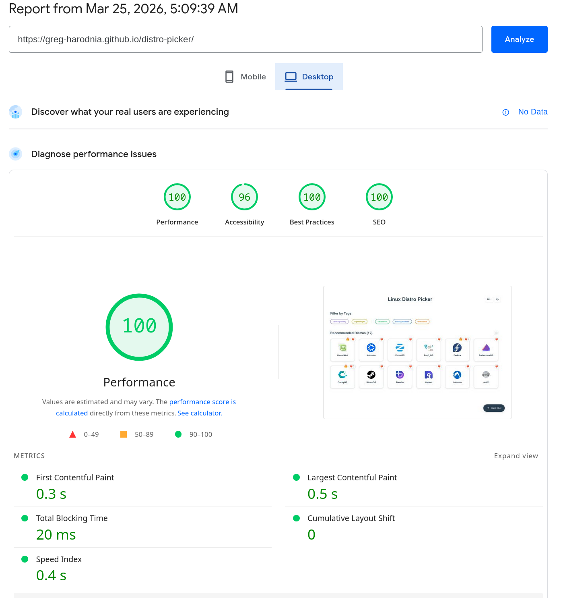

# Linux Distribution Picker

A modern Linux distribution picker built with SvelteKit to help users find the perfect Linux distribution for their needs based on gaming, development, user-friendliness, and other criteria.

 

### Install dependencies

```bash
bun install
```

### Start development server

```bash
bun run dev
```

### Create production build

```bash
bun run build
```

### Preview production build

```bash
bun run preview
```

## 📁 Project Structure

```
distro-picker/
├── docs/
│   ├── SEO.png
│   └── SEO_mobile.png
├── src/
│   ├── app.css
│   ├── app.html
│   ├── lib/
│   │   ├── components/
│   │   │   ├── DistroGrid.svelte
│   │   │   ├── DistroGridSkeleton.svelte
│   │   │   ├── DistroModal.svelte
│   │   │   ├── ErrorDisplay.svelte
│   │   │   ├── GalleryModal.svelte
│   │   │   ├── InfoModal.svelte
│   │   │   ├── LanguageToggle.svelte
│   │   │   ├── LoadingSpinner.svelte
│   │   │   ├── OptimizedImage.svelte
│   │   │   ├── QuickTestModal.svelte
│   │   │   ├── TagFilter.svelte
│   │   │   ├── TagSkeleton.svelte
│   │   │   └── ThemeToggle.svelte
│   │   ├── i18n/
│   │   │   ├── locale.ts
│   │   │   └── translations.ts
│   │   ├── locales/
│   │   │   ├── types.ts      # Type definitions
│   │   │   ├── en.json       # English (bundled, used for SSR)
│   │   │   └── be.json       # Belarusian (bundled, used for SSR)
│   │   ├── stores/
│   │   │   ├── index.ts
│   │   │   └── theme.ts
│   │   ├── types/
│   │   │   └── quiz.ts
│   │   ├── utils/
│   │   │   ├── body.ts
│   │   │   ├── data.ts
│   │   │   ├── imageObserver.ts
│   │   │   ├── index.ts
│   │   │   ├── storage.ts
│   │   │   └── validation.ts
│   │   ├── distros.json
│   │   ├── supabase.ts
│   │   ├── tagGroups.ts
│   │   └── types.ts
│   └── routes/
│       ├── +layout.server.js     # Returns the locale from the URL (`/` -> en, `/be` -> be)
│       ├── +layout.svelte        # Seeds the locale store, canonical + hreflang
│       └── [[lang]]/             # Optional locale segment
│           ├── +page.server.ts
│           ├── +page.svelte
│           └── distro/[id]/
│               ├── +page.server.ts   # entries() prerenders both /distro/x and /be/distro/x
│               └── +page.svelte
├── src/hooks.server.ts           # Rewrites <html lang> per URL during prerender
├── static/
│   ├── screenshots/          # Distro screenshots
│   ├── _headers
│   ├── .nojekyll
│   ├── robots.txt
│   ├── sitemap.xml           # Includes both language variants
│   └── *.webp/*.svg          # Distro logo images
├── package.json
├── svelte.config.js
├── tsconfig.json
└── README.md
```

## 🗄️ Database Structure (Supabase)

### 'distros' table

| Column | Type | Description |
|--------|------|-------------|
| id | text | Primary key (same as 'id' in distros.json) |
| likes | int2 | Number of likes |

Row Level Security (RLS) is enabled with public SELECT and UPDATE policies for the anon role.

## 🌐 Supported Languages

The language is part of the URL, so every version is prerendered as static,
indexable HTML:

| Language | Code | Native Name | URL |
|----------|------|-------------|-----|
| English (default, `x-default`) | `en` | English | `/`, `/distro/{id}` |
| Belarusian | `be` | Беларуская | `/be`, `/be/distro/{id}` |

### How it works

1. **URL is the source of truth** - `/` serves English, `/be` serves
   Belarusian. The root layout reads `params.lang` and seeds the locale store
   *before* rendering, so the emitted HTML (title, description, content,
   JSON-LD, `<html lang>`) matches the URL. No JavaScript required to see the
   right language — search engines and AI crawlers get the full Belarusian
   content directly in the response body.
2. **Switching** - the language toggle renders real links between language
   variants (crawlers can discover `/be` from them), so the choice survives
   bookmarks and shared links. Choosing a language stores an explicit
   preference in `localStorage`, used only by the auto-redirect below — the
   URL remains the source of truth for what is rendered. There is no hash
   state.
3. **Auto-redirect (client-side only)** - after a full page load of an
   English page, visitors with a Belarusian preference — an explicit stored
   choice, `be`-family browser language, or the `Europe/Minsk` timezone — are
   redirected to the `/be` equivalent (e.g. `/distro/mint` → `/be/distro/mint`).
   Since this runs only in the browser *after* the English HTML is served,
   crawlers (which don't run the app's JavaScript) always see — and index —
   the English version; it never affects the prerendered output.
4. **SEO** - each page emits self-referencing canonical plus
   `hreflang="en"` / `hreflang="be"` / `hreflang="x-default"` alternates, and
   the sitemap lists both variants. `src/hooks.server.ts` rewrites
   `<html lang>` per URL at build time.

### Translations

All translations are statically bundled from `src/lib/locales/*.json`, which
makes them available during SSR/prerender. Missing keys fall back to English.

### SEO

The app has a great SEO score (a11y is 96 due to tag color contrasts in the light theme).



<br>**Find Your Perfect Linux Distribution Today! 🐧**
